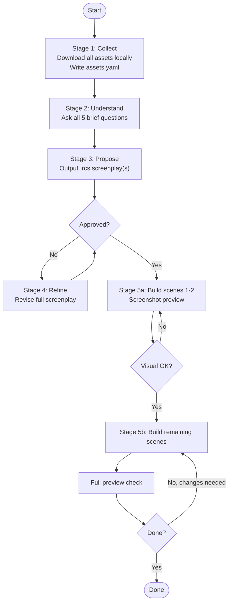

# Roughcut Video Engine

## Overview

Roughcut is a Remotion-based engine for building short-form vertical videos (9:16) from a declarative scene spec (TypeScript DSL). You write a spec, preview it live in Remotion Studio, and export.

Scene types: `text`, `screenshot`, `slideshow`, `chips`, `lockup`.

Built-in overlays: `core:vignette`, `core:film-grain`, `core:lens-flare`, `core:color-grade`, `core:light-leak`, `core:confetti`.

Full overlay reference: `references/overlay-api.md`.

## Workflow



## When to Use This Skill

Use this skill when the user wants to:
- Create a new short-form video (social, app demo, ad, launch clip)
- Add scenes or edit an existing video spec
- Add a new preset, effect, element, or overlay to the engine
- Understand what scene types or fields are available
- Bootstrap a new project inside `src/projects/`

Trigger phrases: "make a video", "create a video", "add a scene", "build a spec", "collect assets", "preview video", "add preset", "add effect".

---

## Core Capabilities

### 1. Collect Assets (Stage 1)

All assets must be local before any spec is written. Never skip this.

**Ask the user:**
- What images/screenshots do they have? (URLs, local paths, anything)
- What key/name to give each one (used as filename and manifest key)

**Run:**
```bash
node scripts/collect-assets.js \
  --dest     public/<project> \
  --manifest src/projects/<project>/assets.yaml \
  --name <key> --src <url-or-path> \
  [--name <key2> --src <path2> ...]
```

Show the resulting `assets.yaml`. Do not proceed until all assets are confirmed local.

---

### 2. Understand the Brief (Stage 2)

Read `assets.yaml` and look at each asset. Then ask all five questions - do not skip any:

1. **What is this video for?** (app launch, ad, demo, social post - platform and goal)
2. **Who is watching?** (existing users, cold audience, investors - what do they already know)
3. **What should they feel at the end?** (convinced, curious, entertained, informed)
4. **Is there a hook line?** (the first thing they read - help them write one if not)
5. **Is there a closing line?** (what the video ends on)

Do not propose a scene breakdown until you have all five answers. They determine scene order, pacing, and tone.

---

### 3. Propose Screenplay(s) (Stage 3)

Output one or more `.rcs` screenplays — not a table, not TypeScript. The screenplay is the review artifact.

Read `references/rcs-format.md` for the full format spec before writing.

**If the user asks for one screenplay**, output it directly:

```
ROUGHCUT SCREENPLAY v1
project: my-app
fps: 30
dimensions: 1080x1920

--- SCENE 1 ---
type: text
duration: 1.5s
...

TOTAL: 9s
```

**If the user asks for two or more**, label and separate them:

```
== SCREENPLAY A: Fast Cut ==

ROUGHCUT SCREENPLAY v1
...

TOTAL: 8s

---

== SCREENPLAY B: Slow Drift ==

ROUGHCUT SCREENPLAY v1
...

TOTAL: 13s
```

Below the screenplay(s) state:
- Intended pacing per option
- Any assumptions made (e.g. "assumed 30fps", "used ken-burns as default preset")

Stop here. Wait for the user to pick a screenplay and explicitly approve it. Silence is not approval.

---

### 4. Refine (Stage 4 - loop)

Take feedback. Output the full revised screenplay each time - not just changed scenes.

Keep iterating until the user explicitly approves. "Looks good", "yes", "go", "ship it". Silence is not approval.

---

### 5a. Build First 1-2 Scenes + Screenshot (Stage 5a)

Only after explicit approval of a screenplay.

1. Read `references/scene-types.md`
2. Read `references/rcs-format.md`
3. For each scene type used, read the source in `src/platform/scenes/` — source is authoritative over docs
4. Read `templates/new-spec.ts`
5. Write `src/projects/<project>/specs/<name>.ts` with **scenes 1-2 only**
6. Add the composition to `src/projects/<project>/index.ts`
7. Ensure Remotion Studio is running:
   ```bash
   npm run preview
   # -> http://localhost:3000
   ```
8. Take a screenshot of the preview using the best available method:

   **Chrome headless** (preferred, if `--chrome` flag passed or `google-chrome`/`chromium` is in PATH):
   ```bash
   google-chrome --headless --screenshot=preview.png --window-size=324,576 http://localhost:3000
   ```

   **macOS** (`screencapture`):
   ```bash
   sleep 2 && screencapture -x preview.png
   ```

   **Linux** (`scrot` or `import`):
   ```bash
   sleep 2 && scrot preview.png
   # or
   sleep 2 && import -window root preview.png
   ```

   Show the screenshot to the user. Ask: does this look right? Fix and re-screenshot until they say yes.

---

### 5b. Build Remaining Scenes (Stage 5b)

Only after visual approval of scenes 1-2.

1. Add the remaining scenes to the spec
2. Screenshot again using the same method as Stage 5a
3. Ask for final feedback
4. Repeat until done

After every spec edit, always tell the user what changed and ask them to check the preview.

---

### 6. Bootstrap a New Project

```bash
# Copy the example project
cp -r src/projects/example src/projects/<your-project>

# Register it
echo '"<your-project>"' >> projects.json  # add to the array

# Sync (auto-generates Root.tsx imports)
node scripts/sync-projects.cjs

# Preview
npm run preview
```

---

## Scene Type Quick Reference

| Type | Use for |
|------|---------|
| `text` | Bold lines animating in independently |
| `screenshot` | Single image with camera motion + element overlays |
| `slideshow` | Multiple images with horizontal swipe |
| `chips` | Elements radiating from center (radiate / radial-spoke) |
| `lockup` | Branding end card - word slam + logo |

Full field reference: `references/scene-types.md`
Screenplay format: `references/rcs-format.md`

---

## Slash Commands

| Command | What it does |
|---------|-------------|
| `/collect-assets` | Stage 1 - download/copy assets, write assets.yaml |
| `/make-video` | Stages 2-5 in one go when assets are already local |
| `/add-preset` | Register a new named camera/atmosphere preset |
| `/add-effect` | Implement a new per-element visual effect |

---

## Reference Files

| File | What it covers |
|------|---------------|
| `references/rcs-format.md` | Roughcut Screenplay (.rcs) format - scene types, elements, effects, overlays |
| `references/scene-types.md` | TypeScript SceneSpec variants with all fields |
| `references/motion-api.md` | Motion types, compose system, motion registry |
| `references/effect-api.md` | Effect types, EffectFn signature, registry |
| `references/preset-api.md` | Preset type, built-in presets, how to add one |
| `references/element-api.md` | Element types, ElementRenderer interface, registry |
| `references/overlay-api.md` | SceneOverlay types, overlay registry, built-in list |

## Templates

| File | Use for |
|------|---------|
| `templates/new-spec.ts` | New video spec for an existing project |
| `templates/new-project.ts` | Bootstrapping a brand new project folder |

## Extension Guides

Each `src/platform/*/agents.md` describes what that directory does and how to extend it. Read before touching that directory.
