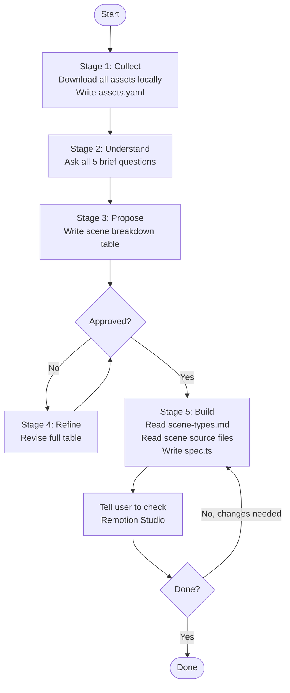

# Roughcut Video Engine

## Overview

Kinecut is a Remotion-based engine for building short-form vertical videos (9:16) from a declarative scene spec (TypeScript DSL). You write a spec, preview it live in Remotion Studio, and export.

Scene types: `text`, `screenshot`, `slideshow`, `chips`, `lockup`.

Built-in overlays: `core:vignette`, `core:film-grain`, `core:lens-flare`, `core:color-grade`, `core:light-leak`, `core:confetti`.

## Workflow



## When to Use This Skill

Use this skill when the user wants to:
- Create a new short-form video (social, app demo, ad, launch clip)
- Add scenes or edit an existing video spec
- Add a new preset, effect, element, or overlay to the engine
- Understand what scene types or fields are available
- Bootstrap a new project inside `src/projects/`

Trigger phrases: "make a video", "create a video", "add a scene", "build a spec", "collect assets", "preview video", "add preset", "add effect".

---

## Core Capabilities

### 1. Collect Assets (Stage 1)

All assets must be local before any spec is written. Never skip this.

**Ask the user:**
- What images/screenshots do they have? (URLs, local paths, anything)
- What key/name to give each one (used as filename and manifest key)

**Run:**
```bash
node scripts/collect-assets.js \
  --dest     public/<project> \
  --manifest src/projects/<project>/assets.yaml \
  --name <key> --src <url-or-path> \
  [--name <key2> --src <path2> ...]
```

Show the resulting `assets.yaml`. Do not proceed until all assets are confirmed local.

---

### 2. Understand the Brief (Stage 2)

Read `assets.yaml` and look at each asset. Then ask all five questions - do not skip any:

1. **What is this video for?** (app launch, ad, demo, social post - platform and goal)
2. **Who is watching?** (existing users, cold audience, investors - what do they already know)
3. **What should they feel at the end?** (convinced, curious, entertained, informed)
4. **Is there a hook line?** (the first thing they read - help them write one if not)
5. **Is there a closing line?** (what the video ends on)

Do not propose a scene breakdown until you have all five answers. They determine scene order, pacing, and tone.

---

### 3. Propose Scene Breakdown (Stage 3)

Write a human-readable table. No TypeScript yet.

| # | Type | Duration | Content | Notes |
|---|------|----------|---------|-------|
| 1 | text | 1.5s | "hook line" / "second line" (accent) | cold open, cuts fast |
| 2 | screenshot | 3s | profile asset, ken-burns preset, Red Flag pill at 1.2s | establish the app |
| 3 | chips | 4s | 4 type chips radiate out, stamp at 3s | pattern recognition moment |
| 4 | lockup | 2.5s | closing hook / app name / tagline | end card |

Below the table state:
- Total duration
- Intended pacing (fast cut / slow drift / mixed)
- Any assumptions made (e.g. "assumed 30fps")

Stop here. Wait for feedback. Do not write code.

---

### 4. Refine (Stage 4 - loop)

Take feedback. Revise the full table and show it again each time - not just changed rows.

Keep iterating until the user explicitly approves. "Looks good", "yes", "ship it". Silence is not approval.

---

### 5. Build the Spec (Stage 5)

Only after explicit approval.

**Steps:**
1. Read `references/scene-types.md` - all fields for every scene type
2. For each scene type you're using, read the corresponding source file in `src/platform/scenes/` (e.g. `TextScene.tsx`, `ScreenshotScene.tsx`, `SlideshowScene.tsx`) — the source is authoritative; docs may be stale
3. Read `templates/new-spec.ts` - boilerplate structure
3. Write `src/projects/<project>/specs/<name>.ts`
4. Add the composition to `src/projects/<project>/index.ts`
5. Tell the user to run Remotion Studio if not already running:
   ```bash
   npm run preview
   # -> http://localhost:3000
   ```
6. Ask them to check the preview and report back with feedback

After writing or editing a spec, always tell the user to check Remotion Studio and describe what to change. Edit the spec based on feedback. Repeat until they say done.

---

### 6. Bootstrap a New Project

```bash
# Copy the example project
cp -r src/projects/example src/projects/<your-project>

# Register it
echo '"<your-project>"' >> projects.json  # add to the array

# Sync (auto-generates Root.tsx imports)
node scripts/sync-projects.cjs

# Preview
npm run preview
```

---

## Scene Type Quick Reference

| Type | Use for |
|------|---------|
| `text` | Bold lines animating in independently |
| `screenshot` | Single image with camera motion + element overlays |
| `slideshow` | Multiple images with horizontal swipe |
| `chips` | Elements radiating from center (radiate / radial-spoke) |
| `lockup` | Branding end card - word slam + logo |

Full field reference: `references/scene-types.md`

---

## Slash Commands

| Command | What it does |
|---------|-------------|
| `/collect-assets` | Stage 1 - download/copy assets, write assets.yaml |
| `/make-video` | Stages 2-5 in one go when assets are already local |
| `/add-preset` | Register a new named camera/atmosphere preset |
| `/add-effect` | Implement a new per-element visual effect |

---

## Reference Files

| File | What it covers |
|------|---------------|
| `references/scene-types.md` | Every SceneSpec variant with all fields |
| `references/motion-api.md` | Motion types, compose system, motion registry |
| `references/effect-api.md` | Effect types, EffectFn signature, registry |
| `references/preset-api.md` | Preset type, built-in presets, how to add one |
| `references/element-api.md` | Element types, ElementRenderer interface, registry |
| `references/overlay-api.md` | SceneOverlay types, overlay registry, built-in list |

## Templates

| File | Use for |
|------|---------|
| `templates/new-spec.ts` | New video spec for an existing project |
| `templates/new-project.ts` | Bootstrapping a brand new project folder |

## Extension Guides

Each `src/platform/*/agents.md` describes what that directory does and how to extend it. Read before touching that directory.
